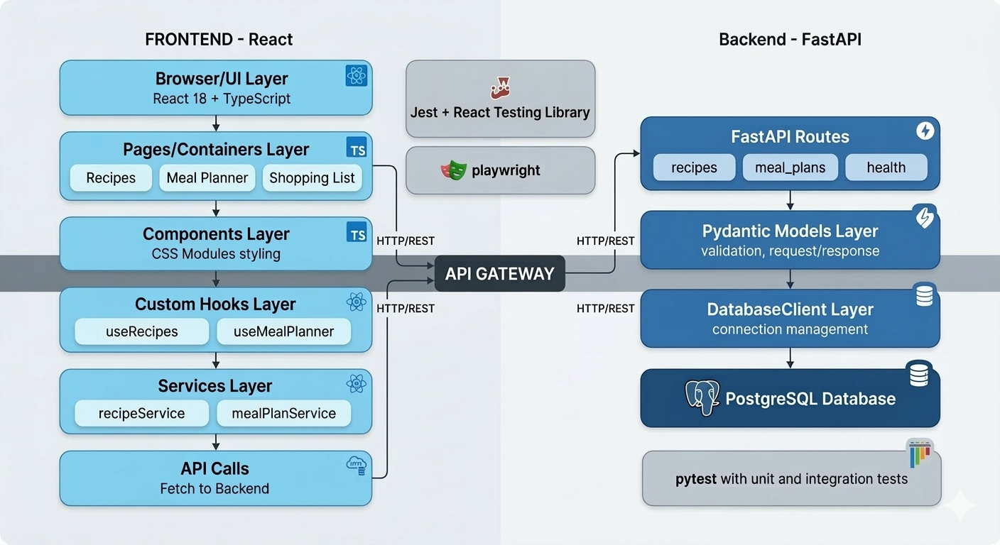

# Architecture

## Overview

Meal Planner is a two-tier web application:

- **Frontend**: React 18 + TypeScript single-page application (SPA)
- **Backend**: FastAPI REST API with PostgreSQL database
- **Communication**: HTTP/REST with JSON payloads

## Tools & Tech Stack

### Frontend

- 🚀 **React** 18.2.0 – UI framework
- 🔷 **TypeScript** 4.9.5 – Type safety
- 🎨 **CSS Modules** – Component-scoped styling
- 📝 **ESLint** 5.62.0 – Code linting
- ✨ **Prettier** 2.8.8 – Code formatting
- 🎭 **lucide-react** – Icon library
- 📦 **clsx** – Conditional CSS classes

### Backend

- ⚡ **FastAPI** 0.104.1 – Web framework
- 🌐 **Uvicorn** 0.24.0 – ASGI server
- ✅ **Pydantic** – Data validation (included with FastAPI)
- 🗄️ **psycopg2-binary** 2.9.10 – PostgreSQL driver
- ⚙️ **python-dotenv** 1.0.0 – Environment variables
- 🔍 **flake8** 6.1.0 – Python linting

### Database

- 🐘 **PostgreSQL** 15 – Relational database

---

For detailed patterns and rules, see [.claude/rules/architecture.md](./.claude/rules/architecture.md).
